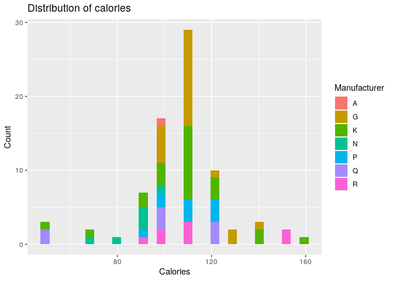
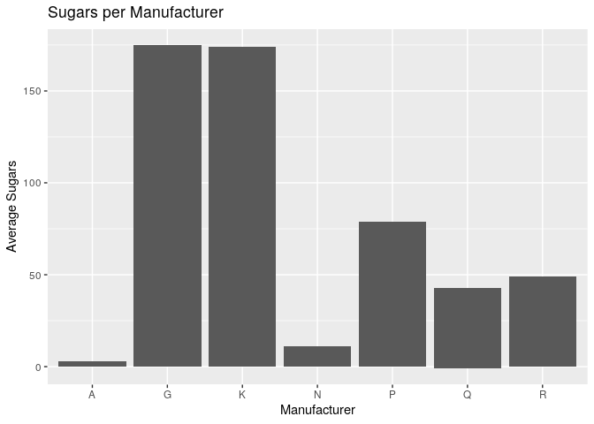
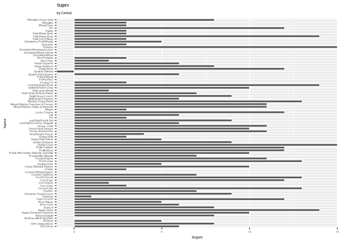
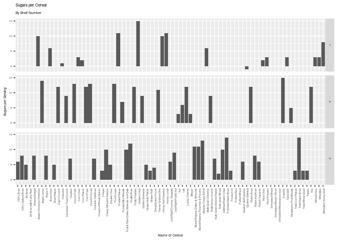
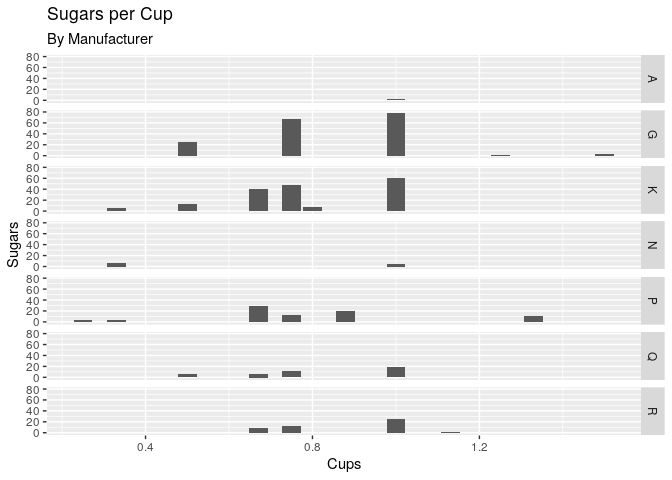
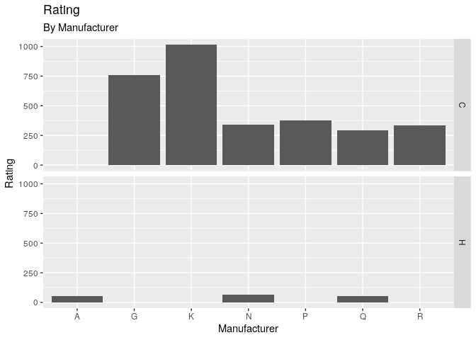

Project 8
================
brunswick-green

``` r
library(tidyverse)
```

    ## ── Attaching packages ─────────────────────────────────────── tidyverse 1.3.0 ──

    ## ✓ ggplot2 3.3.2     ✓ purrr   0.3.4
    ## ✓ tibble  3.0.4     ✓ dplyr   1.0.2
    ## ✓ tidyr   1.1.2     ✓ stringr 1.4.0
    ## ✓ readr   1.4.0     ✓ forcats 0.5.0

    ## ── Conflicts ────────────────────────────────────────── tidyverse_conflicts() ──
    ## x dplyr::filter() masks stats::filter()
    ## x dplyr::lag()    masks stats::lag()

``` r
cereal <- read_csv("data/cereal.csv")
```

    ## 
    ## ── Column specification ────────────────────────────────────────────────────────
    ## cols(
    ##   name = col_character(),
    ##   mfr = col_character(),
    ##   type = col_character(),
    ##   calories = col_double(),
    ##   protein = col_double(),
    ##   fat = col_double(),
    ##   sodium = col_double(),
    ##   fiber = col_double(),
    ##   carbo = col_double(),
    ##   sugars = col_double(),
    ##   potass = col_double(),
    ##   vitamins = col_double(),
    ##   shelf = col_double(),
    ##   weight = col_double(),
    ##   cups = col_double(),
    ##   rating = col_double()
    ## )

**cereal = Nutritional and Marketing Information on US Cereals** [Link
to Variable
Description](https://www.kaggle.com/crawford/80-cereals?select=cereal.csv)

### Numerical Summaries

``` r
summary(cereal)
```

    ##      name               mfr                type              calories    
    ##  Length:77          Length:77          Length:77          Min.   : 50.0  
    ##  Class :character   Class :character   Class :character   1st Qu.:100.0  
    ##  Mode  :character   Mode  :character   Mode  :character   Median :110.0  
    ##                                                           Mean   :106.9  
    ##                                                           3rd Qu.:110.0  
    ##                                                           Max.   :160.0  
    ##     protein           fat            sodium          fiber       
    ##  Min.   :1.000   Min.   :0.000   Min.   :  0.0   Min.   : 0.000  
    ##  1st Qu.:2.000   1st Qu.:0.000   1st Qu.:130.0   1st Qu.: 1.000  
    ##  Median :3.000   Median :1.000   Median :180.0   Median : 2.000  
    ##  Mean   :2.545   Mean   :1.013   Mean   :159.7   Mean   : 2.152  
    ##  3rd Qu.:3.000   3rd Qu.:2.000   3rd Qu.:210.0   3rd Qu.: 3.000  
    ##  Max.   :6.000   Max.   :5.000   Max.   :320.0   Max.   :14.000  
    ##      carbo          sugars           potass          vitamins     
    ##  Min.   :-1.0   Min.   :-1.000   Min.   : -1.00   Min.   :  0.00  
    ##  1st Qu.:12.0   1st Qu.: 3.000   1st Qu.: 40.00   1st Qu.: 25.00  
    ##  Median :14.0   Median : 7.000   Median : 90.00   Median : 25.00  
    ##  Mean   :14.6   Mean   : 6.922   Mean   : 96.08   Mean   : 28.25  
    ##  3rd Qu.:17.0   3rd Qu.:11.000   3rd Qu.:120.00   3rd Qu.: 25.00  
    ##  Max.   :23.0   Max.   :15.000   Max.   :330.00   Max.   :100.00  
    ##      shelf           weight          cups           rating     
    ##  Min.   :1.000   Min.   :0.50   Min.   :0.250   Min.   :18.04  
    ##  1st Qu.:1.000   1st Qu.:1.00   1st Qu.:0.670   1st Qu.:33.17  
    ##  Median :2.000   Median :1.00   Median :0.750   Median :40.40  
    ##  Mean   :2.208   Mean   :1.03   Mean   :0.821   Mean   :42.67  
    ##  3rd Qu.:3.000   3rd Qu.:1.00   3rd Qu.:1.000   3rd Qu.:50.83  
    ##  Max.   :3.000   Max.   :1.50   Max.   :1.500   Max.   :93.70

### Renaming

``` r
#cereal %>%
  #rename.values(mfr, G = "G")
```

## Nutritionals

### Calories

``` r
cereal %>% 
  ggplot() +
    geom_histogram(mapping = aes(x = calories, fill = mfr), position = "stack") +
    labs(fill = "Manufacturer", 
         title = "Distribution of calories",
         x = "Calories",
         y = "Count") 
```

    ## `stat_bin()` using `bins = 30`. Pick better value with `binwidth`.

<!-- -->

### Sugars

``` r
cereal %>%
ggplot() +
  geom_col(mapping = aes(x = mfr, y = sugars)) +
  labs(title = "Sugars per Manufacturer",
       y = "Average Sugars",
       x = "Manufacturer") 
```

<!-- -->

``` r
cereal %>%
ggplot() +
  geom_col(mapping = aes(x = name , y = sugars), color = "white") +
  theme(text = element_text(size=5)) +
  labs(title = "Sugars",
       subtitle = "by Cereal",
       x = "Name",
       y = "Sugars" ) +
  coord_flip(xlim = NULL, ylim = NULL, expand = FALSE, clip = "on")
```

<!-- -->

``` r
cereal %>%
ggplot() +
  geom_col(mapping = aes(x = name, y = sugars)) +
  facet_grid(cereal$shelf~.) +
  theme(text = element_text(size=5),
        axis.text.x = element_text(angle=90, hjust=1))+
  labs(title = "Sugars per Cereal",
       subtitle = "By Shelf Number",
       x = "Name of Cereal",
       y = "Sugars per Serving" )
```

<!-- -->

## Serving Size, By Manufacturer

``` r
cereal %>%
ggplot() +
  geom_col(mapping = aes(x = cups, y = sugars)) +
  facet_grid(mfr~.) +
  labs(title = "Sugars per Cup",
       subtitle = "By Manufacturer",
       x = "Cups",
       y = "Sugars" )
```

<!-- -->

## Ratings by Manufacturer

``` r
cereal %>%
ggplot() +
  geom_col(mapping = aes(x = mfr, y = rating)) +
  facet_grid(type~.) +
  labs(title = "Rating",
       subtitle = "By Manufacturer",
       x = "Manufacturer",
       y = "Rating" )
```

<!-- -->
